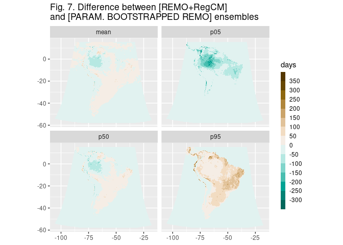

# Bootstrapping CORDEX data: some experiments

In this repo I experimented with bootstrapping REMO2015 model data in an attempt to: (a) obtain confidence intervals for certain statistics and (b) assess the extent with which a bootstrapped REMO ensemble could emulate a REMO+RegCM ensemble. You can read the final report of my experiments [here](reports/comparisons.md).  
