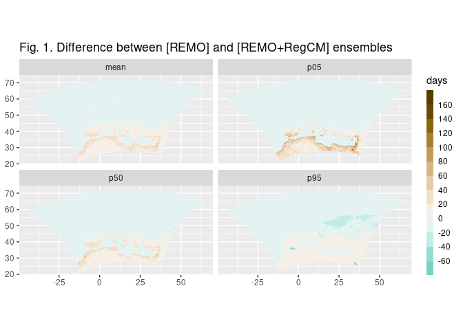
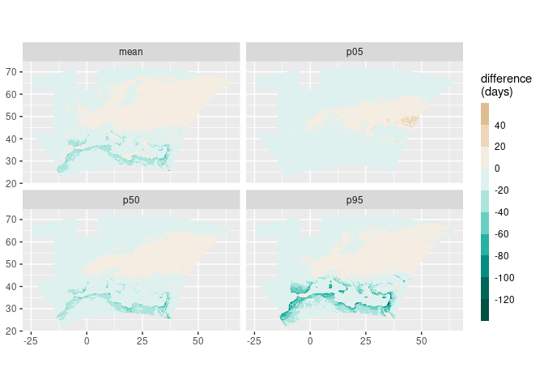
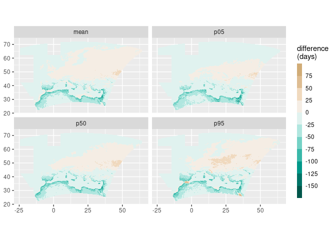
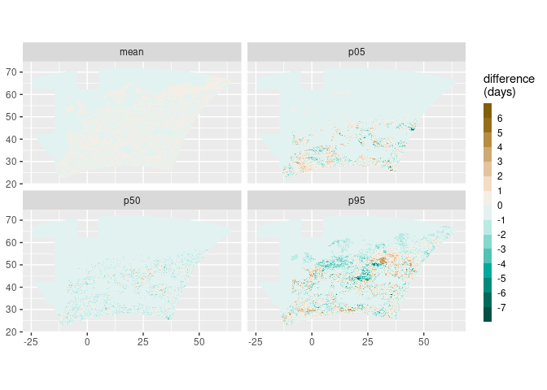
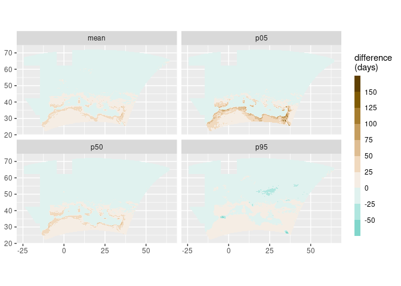

Comparisons
================
Carlos Dobler
2022-10-27

### 1. REMO ensemble vs. WHOLE ensemble

<!-- -->

### 2. RegCM ensemble vs. WHOLE ensemble

<!-- -->

### 3. RegCM ensemble vs. REMO ensemble

<!-- -->

### 4. REMO ensemble vs. REMO bootstrapped ensemble

<!-- -->

### 5. REMO bootstrapped ensemble vs. WHOLE ensemble

<!-- -->
