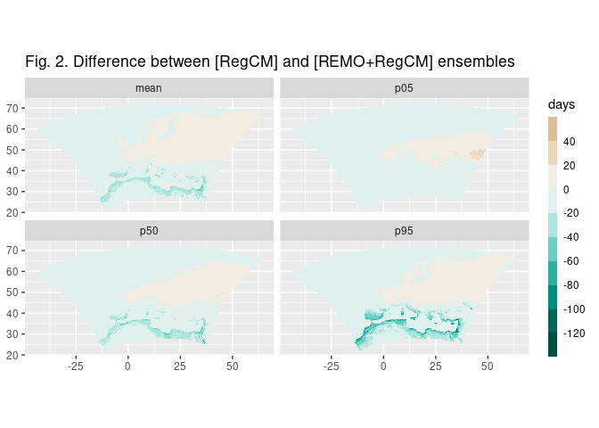
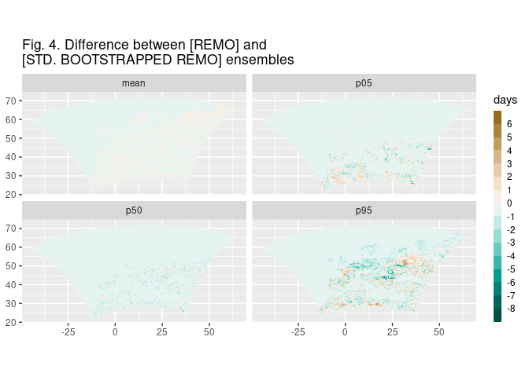
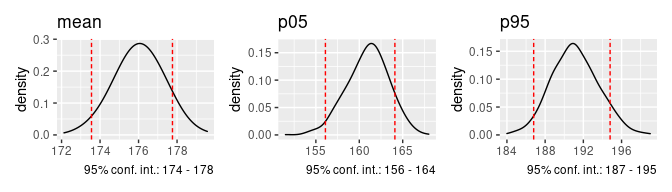

Comparisons
================
Carlos Dobler
2022-10-27

Here I compare different ensembles of REMO/RegCM model output
corresponding to days above 32 C in a 2C warming level over Europe.

The following three set of maps compare “raw” output between REMO (3
members), RegCM (3 members), and REMO+RegCM (6 members) ensembles. I
show differences in the mean count of days above threshold, as well as
percentiles 5th, 50th (median) and 95th.

The maps above indicate that RegCM and REMO contribute in different ways
to the full ensemble. Their different contribution is most evident in
Figure 3. Overall, RegCM tends to run “cooler” (more days above
threshold) over northern Africa than REMO.

In the next set of maps I compare some of the previous maps with two
bootstrapped experiments conducted with REMO. The first experiment
represents a regular bootstrap. For each cell, I resampled the original
sample of 63 observations (21 years x 3 REMO models) with replacement
1000 times. This means: imagine I have a bag of 63 balls, each one
representing one observation (1 observation = the count of days above
32C in 1 year for 1 model). I randomly pick one ball, register its
value, and return it to the bag. I do that 63 times. Then I calculate
the mean and percentiles 5th, 50th and 95th out of those 63
observations. Then I re-do that 1000 times. Lastly, I calculate the mean
of those 1000 means, 5th, 50th, and 95th percentiles.

As a second experiment I conducted a parametric bootstrapping. For each
cell, I fitted a binomial distribution to its 63 values. I’m using
binomial because our underlying variable is binomial: days either exceed
the threshold (= 1), or they don’t (= 0). Once fitted, I generate 1000
samples of 63 observations based on that distribution. And then, same as
before, I calculate the mean and percentiles of the 63 observations for
each of the 1000 iterations, to then calculate the mean of those 1000
statistics.

Note: when fitting a distribution we assume our data (the 63
observations) is “incomplete”; it’s just a sample out of a larger
“population”. A fitted distribution essentially represents how that
population looks like. The following figure shows nine examples
comparing the empirical (“observed”) distribution of the 63 observations
found in a cell (solid line) and their fitted distribution (dashed).

As mentioned above, from the fitted distribution I drew 1000 random
samples of 63 observations and calculated the means of the 1000 means
and percentiles. See below how that ensemble compares with the raw REMO
ensemble.

The following map compares the two bootstrap experiments:

The bootstrapped ensembles seem to obtain similar mean values to the
full ensemble (REMO + RegCM), although they deviate more over the tails
(5th and 95th percentiles). Both bootstrapped ensembles run “hotter” in
the 5th percentile than the full ensemble (particularly over northern
Africa), and “cooler” in the 95th percentile (particularly over eastern
Europe). Between both bootstrapped ensembles mean values are quite
similar, but the standard one is “cooler” than the parametric in the 5th
percentile, and “warmer” in the 95th percentile.

Another note: the 1000 means (or any of the percentiles) I obtain from
bootstrapping are theoretically normally distributed. For example, this
is the distribution of the 63 “raw” observations of one cell:

And below are the distributions of the 1000 means, 5th, and 95th
percentiles that came from bootstrapping those 63 “raw” observations.
The fact that they are normally distributed means I can calculate their
2.5th and 97.5th percentiles to obtain my 95% confidence interval (red
dashed lines). With those numbers I can state something like, “based on
REMO, the mean count of days above 32C is between 174 and 178 with 95%
confidence” (based on the left facet).

